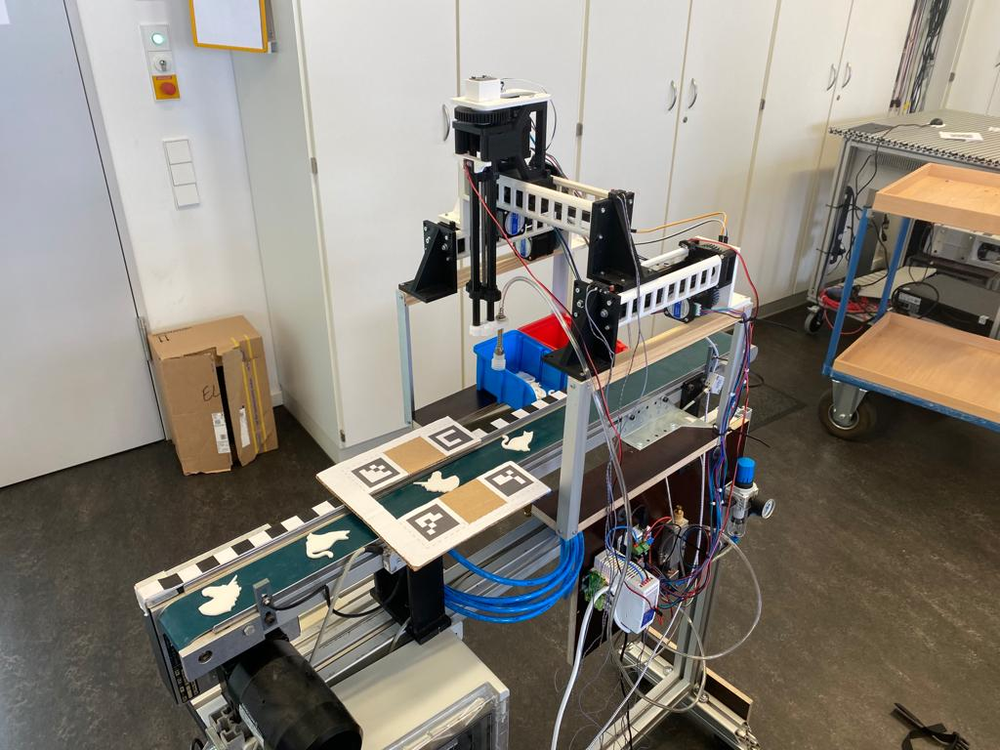

# RobotikProjekt3


## Installation
Bevor sie das package installieren stellen Sie sicher, dass ROS 2 richtig installiert wurde und Sie eine funktionierende ROS 2 Umgebung konfiguriert haben.
Zur Installation und Konfiguration wird auf die ROS 2 Dokumentation verwiesen: https://docs.ros.org/en/humble/index.html

Um das package zu installieren, clonen sie den src Ordner in ihr ros2-workspace-Verzeichnis
<br>Falls Sie schon einen existierenden src Ordner haben, können Sie den Inhalt des *RobotikProjekt3/src* Ordners in diesen kopieren.

Stellen Sie sicher das alle beöntigten Python Bibliotheken installiert sind. Folgende Bibliotheken werden benötigt:
- rcply
- rcply.ode
- sensor_msgs.msg
- cv_bridge
- cv2
- numpy
- sklearn
- math
- time
- joblib
- pandas
- cv2.aruco

Bevor Sie das Paket bauen, überprüfen Sie ob ihre dependencies richtig installiert sind.
Wechseln sie im Terminal in ihren ros2-workspace und führen sie den Befehl: ```rosdep install -i --from-path src --rosdistro humble -y``` aus.
<br> Die Konsole sollte ```#All required rosdeps installed succesfully```anzeigen

Wechseln Sie im Terminal in ihr ros2-workspace Verzeichnis und führen Sie dort den folgenden Befehl aus: <br>```colcon build ``` Dieser Vorgang kann ein paar Minuten in Anspruch nehmen

## Anleitung zum Starten des Systems
### 1. Installation vorbereiten:
- Stellen Sie sicher, dass alle erforderlichen Komponenten und Software vorhanden sind.
### 2. USB-Slots freigeben:
 - Öffnen Sie ein Terminal und führen Sie den Befehl : ```sudo usermod –a –G dialout $USER```aus.
### 3. Anschließen der USB-Verbidungen
 - Schließen Sie die zwei USB-Kabel (ESP, Arduino) der Sortiermaschine an
 - Stellen Sie sicher dass der Arduino und ESP verbunden und verfügbar sind.
   <br> Im Terminal eingeben: ```ls /dev/``` in dieser Liste müssten die Namen ```ttyACM0``` und ```ttyUSB0```erscheinen.
   <br> Falls die Portnamen unterschiedlich sind müssen Sie die Datei: ```install/ro45_ros2_pickrobot_serial/share/ro45_ros2_pickrobot_serial/config/ro45_params.yaml``` anpassen oder den Parameter manuell überschreiben.
### 4. Nullpunkt der Sortiermaschine einstellen
-  Öffnen Sie ein Terminal und wechseln sie in ihr ros2-workspace-Verzeichnis
-  Sourcen Sie ihr ROS2-Overlay:```source install/setup.bash```
-  Starten sie die Serial Knoten mit dem Befehl: ```ros2 launch ro45_ros2_pickrobot_serial launch_nodes.py```
-  Öffnen Sie ein weiteres Terminal, wechseln sie in ihr ros2-workspace-Verzeichnis und sourcen Sie ihr Overlay erneut. Führen sie dann den Befehl ```rqt```aus.
-  Im rqt Fenster erscheinen nun die topics ```/robot_command``` ```/robot_position```
-  Erstellen sie auf der Rechten Seite im Fenster unter **Message Publisher** einen neuen Publisher mit der Topic ```/robot_command``` vom Type ```ro45_portalrobot_interfaces/msg/RobotCmd``` mit einer Frequenz (Freq.) von ```10```Hz und klicken Sie auf das ```+```
-  Klappen Sie nun ihren Publisher auf (Pfeil klicken) und setzen sie die Parameter von ```vel_x``` ```vel_y``` ```vel_z``` auf ```-0.01``` (In der Spalte *expression*)
-  Setzen Sie nun im Freien Kästchen neben ihrer ```/robot_command``` Topic einen Haken. Die Maschine fährt nun auf ihren Nullpunkt.
-  Wenn sich die Maschine nicht mehr bewegt und auf alle Endschalter gefahren ist, stoppen Sie den Serial Knoten ```STRG + C ``` im Terminal und nehmen sie den Haken wieder aus dem Kästchen
-  Schalten Sie die Sortiermaschine ab und trennen Sie die USB-Verbindungen. Warten Sie ein paar Sekunden
-  Schließen Sie die USB-Verbindungen wieder an und schalten Sie die Maschine ein
-  Starten Sie nun den Serial Knoten erneut und
   wählen Sie im rqt Fenster unter **Topic Monitor** ```/robot_position``` aus (Haken im Kästchen) und klappen sie diese auf (Pfeil klicken)
   ```pos_x``` ```pos_y``` ```pos_z``` haben nun den *Value* ```0.0``` Der Nullpunkt ist nun gesetzt.
   <br> Falls die Werte nicht 0.0 sind, versuchen sie den Vorgang erneut und starten Sie auch das rqt Fenster neu!
### 5. AruCo Marker positionieren:
- Platzieren sie die AruCo Marker gemäß dem beigefügten Bild:
  <br>Die Marker müssen parallel zum Förderbad liegen und das Förderband muss zwischen den AruCo Markern komplett sichtbar sein!
<br> 
### 6. Kamera ausrichten
- Schließen sie die Kamera an ihren Computer an
  #### Für die folgenden Schritte können Sie die bereitgestellte Kamera Anwendung ihres Computers verwenden: 
- Überprüfen sie ob die Kamera scharf gestellt ist. falls nicht -> Kamera scharf stellen
- Richten Sie die Kamera so aus dass sich die AruCo Marker in der Mitte vom Bild befinden und vollständig zu sehen sind.

### 7. Starten des Gesamtsystems
- Öffnen Sie ein neues Terminal und wechseln sie in ihr ros2-workspace-Verzeichnis
- Sourcen Sie ihr ROS2-Overlay ```source install/setup.bash```
- Starten Sie die Knoten über die launch datei mit folgendem Befehl: ```ros2 launch robot_startup robot_launch.py```
  <br> Die Maschine fährt nun auf die Idle-Position und es kann sortiert werden

# Bedienungsanleitung für die Verwendung des Test Runners und der vorhandenen Unit-Tests 

Vielen Dank, dass Sie unsere Software-Komponenten testen möchten. Diese Bedienungsanleitung 
führt Sie durch die Schritte, um den Test Runner zu verwenden und alle vorhandenen Unit-Tests 
gleichzeitig auszuführen, um sicherzustellen, dass die Funktionalität der Komponente korrekt ist. 
## Voraussetzungen: 
1. Stellen Sie sicher, dass Sie Python auf Ihrem Computer installiert haben. Wenn Python noch 
nicht installiert ist, können Sie es von der offiziellen Website (https://www.python.org/) 
herunterladen und installieren. 
2. Überprüfen Sie, ob die erforderlichen Bibliotheken cv2 (OpenCV) und numpy installiert sind. 
Diese Bibliotheken werden für die Bildverarbeitung und die Arbeit mit Arrays benötigt. Wenn 
sie noch nicht installiert sind, können Sie sie mithilfe des Python-Paketmanagers pip 
installieren: 
<br>```pip install opencv-python ```
<br> ```pip install numpy``` 
## Schritte zur Ausführung der Unit-Tests mit dem Test Runner: 
3. Laden Sie alle gegebenen Codes für die Software-Komponenten, z.B. die Komponente 
„transform_to_birds_eye_view", und den Test Runner herunter und speichern Sie die Dateien 
auf Ihrem Computer. 
4. Stellen Sie sicher, dass Ihre Testdateien im Verzeichnis "robotik_projekt" gespeichert sind und 
dass diese Dateien mit "test_" beginnen und die Dateiendung ".py" haben. Beispiel: 
"test_transform_to_birds_eye_view.py". 
## Öffnen Sie ein Terminal (Linux/Mac) oder die Eingabeaufforderung (Windows) auf Ihrem Computer. 
5. Navigieren Sie im Terminal oder der Eingabeaufforderung zum Verzeichnis, in dem Sie die 
heruntergeladenen Dateien gespeichert haben. Verwenden Sie dazu den Befehl cd (Change 
Directory).
6. Führen Sie den Test Runner aus, um alle Unit-Tests für die vorhandenen Software-Komponenten auszuführen. Geben Sie dazu den folgenden Befehl ein und drücken Sie die 
Eingabetaste: 
<br>```python test_runner.py ```

Der Test Runner startet nun automatisch alle vorhandenen Unit-Tests. Sie sehen die Testergebnisse in 
der Kommandozeile, die Ihnen mitteilen, ob alle Tests erfolgreich waren oder ob es Fehler oder 
Fehlschläge gab. 
## Interpretation der Testergebnisse:
7. Wenn alle Tests erfolgreich waren, erhalten Sie eine Bestätigung, dass die Komponenten 
ordnungsgemäß funktioniert und die erwarteten Ergebnisse liefert.
8. Wenn es Fehler oder Fehlschläge gibt, erhalten Sie eine Fehlermeldung mit Informationen, 
welche Tests fehlgeschlagen sind. Diese Fehlermeldungen helfen Ihnen dabei, potenzielle 
Probleme in der SoŌware zu identifizieren, damit Sie diese beheben können.
<br>**Hinweis:** Wenn Sie Änderungen an den Software-Komponenten, z.B. der 
"transform_to_birds_eye_view"-Komponente, vornehmen, empfehlen wir Ihnen, den Test Runner 
erneut auszuführen, um sicherzustellen, dass Ihre Änderungen keine unerwünschten Auswirkungen 
haben und die Software weiterhin zuverlässig arbeitet.
Mit unserem Test Runner können Sie die Qualität und Funktionalität Ihrer Software-Komponenten 
einfach überprüfen und sicherstellen, dass sie den Anforderungen gerecht werden. 
## Durchführung einzelner Unit-Tests 
Hier ist die zusätzliche Information zur Durchführung einzelner Unit-Tests unabhängig vom Test 
Runner: Wenn Sie einzelne Unit-Tests unabhängig vom Test Runner durchführen möchten, befolgen 
Sie bitte diese Schritte:
1. Öffnen Sie ein Terminal (Linux/Mac) oder die Eingabeaufforderung (Windows) auf Ihrem 
Computer.
2. Navigieren Sie im Terminal oder der Eingabeaufforderung zum Verzeichnis, in dem sich die 
Testdateien befinden. Verwenden Sie dazu den Befehl cd (Change Directory). 
3. Führen Sie den gewünschten Unit-Test aus, indem Sie den entsprechenden Befehl eingeben. 
Die Testdateien haben das Format "test_{name}.py", wobei "{name}" für den Namen der 
Software-Komponente steht, die Sie testen möchten. Beispiel: 
"test_transform_to_birds_eye_view.py". 
4. Verwenden Sie den Befehl "python" gefolgt vom Dateinamen des Unit-Tests, um diesen 
auszuführen. Beispiel: 
```python test_transform_to_birds_eye_view.py``` 
5. Der ausgewählte Unit-Test wird nun ausgeführt und Sie erhalten die Testergebnisse in der 
Kommandozeile. Wenn der Test erfolgreich ist, wird dies bestätigt. Falls es Fehler oder 
Fehlschläge gibt, werden entsprechende Fehlermeldungen angezeigt. 
Indem Sie einzelne Unit-Tests unabhängig ausführen, können Sie gezielt bestimmte Software-Komponenten testen und potenzielle Probleme identifizieren. Dies ermöglicht Ihnen eine effektive 
Fehlerbehebung und verbessert die Gesamtqualität Ihrer Software.
Bei Fragen oder Problemen stehen wir Ihnen gerne zur Verfügung. 
Mit freundlichen Grüßen, 
Ihr Software-Team (Computer Clowns) 


 
